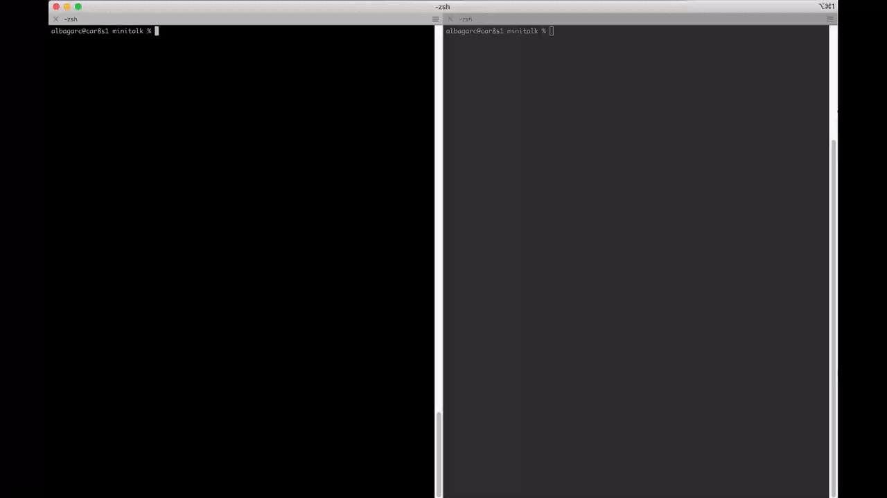

# Minitalk
The purpose of this project is to code a small data exchange program
using UNIX signals. There are two programs, client and server.
*Bonus
The server acknowledges every message received by sending back a signal to the
client and supports unicode characters.


⬇ To pull files ⬇
```bash
$ git clone git@github.com:albagg3/42_Minitalk.git
```
⚙ To compile the server & the client ⚙
```bash
$ make
```
⚙ To compile the server_bonus & the client_bonus ⚙
```bash
$ make bonus
```
## How does it work?


### ✨Personal learning✨
* What are UNIX signals and how to use them.
* Create programs sending and receiving UNIX signals.
* Convert a char to binary.
